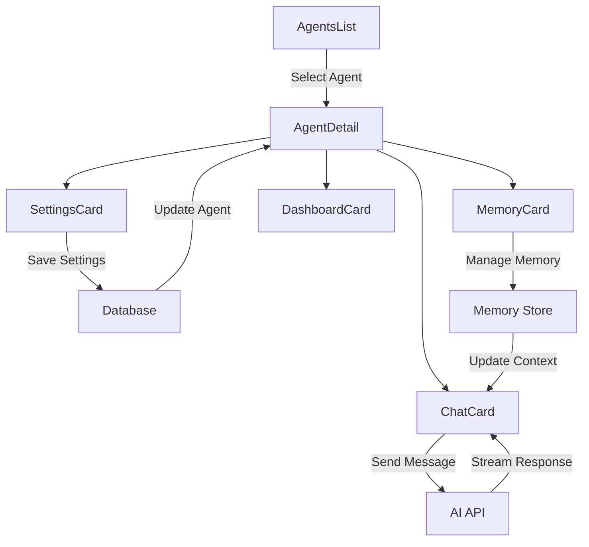

# Agents Components

A comprehensive set of React components for managing AI agents within the Agelum platform. These components provide a full-featured interface for agent management, configuration, and interaction.

## 🏗️ Architecture Overview

The agents components follow a hierarchical structure with clear separation of concerns:

```
agents/
├── AgentDetail.tsx          # Main agent detail view with tabbed interface
├── AgentsList.tsx           # Hierarchical agent list with tree structure
├── agentDetails/           # Sub-components for agent detail tabs
│   ├── ChatCard.tsx        # Real-time chat interface with agents
│   ├── DashboardCard.tsx   # Agent dashboard and metrics
│   ├── MemoryCard.tsx      # Memory management interface
│   ├── SettingsCard.tsx    # Agent configuration settings
│   ├── types.ts           # TypeScript type definitions
│   └── chatCard/          # Chat-specific sub-components
│       ├── MemorySelectionBar.tsx    # Memory selection interface
│       └── MemoriesDialogContent.tsx # Memory dialog content
└── README.md              # This documentation
```

## 🎯 Core Components

### AgentDetail

The main component that provides a tabbed interface for agent management.

**Features:**

- **Tabbed Navigation**: Dashboard, Chat, Memory, Settings tabs
- **State Management**: Tracks changes and provides save/cancel functionality
- **URL Integration**: Syncs active tab with URL parameters
- **Change Detection**: Highlights unsaved changes with action buttons

**Props:**

```typescript
type AgentDetailProps = {
  defaultTab?: string // Default active tab ('chat', 'dashboard', etc.)
  agent?: Agent // Agent data object
  onSave?: (agent: Partial<Agent>) => Promise<void> // Save handler
}
```

**Usage:**

```tsx
<AgentDetail defaultTab="chat" agent={selectedAgent} onSave={handleAgentSave} />
```

### AgentsList

A hierarchical tree view for displaying and navigating agents with parent-child relationships.

**Features:**

- **Tree Structure**: Supports nested agent hierarchies
- **Expandable Nodes**: Collapsible parent agents with visual indicators
- **Interactive Selection**: Click to select agents with visual feedback
- **Agent Creation**: Integrated "Add new agent" functionality
- **Parent-Child Relationships**: Visual lines connecting related agents

**Props:**

```typescript
type AgentsListProps = {
  agents: Agent[] // Array of all agents
  selectedId?: string // Currently selected agent ID
  createAgent: (formData: FormData) => Promise<Agent> // Agent creation handler
  organizationId: string // Current organization ID
}
```

**Usage:**

```tsx
<AgentsList
  agents={organizationAgents}
  selectedId={currentAgentId}
  createAgent={handleCreateAgent}
  organizationId={org.id}
/>
```

## 📋 Detail Tab Components

### ChatCard

Real-time chat interface for communicating with AI agents.

**Features:**

- **Streaming Chat**: Real-time message streaming using Vercel AI SDK
- **Instance Management**: Support for agent instances (when `doesClone` is true)
- **Memory Integration**: Select and manage memories for context
- **Task Creation**: Create scheduled tasks and workflows
- **Collapsible Sidebar**: Expandable instances panel

**Key Functions:**

- Real-time message exchange with AI agents
- Memory selection and context management
- Task scheduling and workflow creation
- Agent instance management

### SettingsCard

Comprehensive agent configuration interface.

**Features:**

- **Basic Settings**: Name, role, active status, cloning capabilities
- **System Prompts**: Configure agent behavior and personality
- **Tool Management**: Assign and configure tools with permissions
- **Policy Rules**: Define behavioral policies and constraints
- **Memory Rules**: Configure memory storage and retention policies

**Configuration Areas:**

- **Basic Info**: Name, role, active status, instance settings
- **Behavior**: System prompts and behavioral configuration
- **Tools**: Available tools and usage permissions
- **Policies**: Rules and constraints for agent behavior
- **Memory**: Memory storage and retention settings

### MemoryCard

Interface for managing agent memories and context.

**Features:**

- **Memory Listing**: Display all stored memories
- **Memory Selection**: Select specific memories for context
- **Memory Management**: Add, remove, and organize memories

### DashboardCard

Agent analytics and performance dashboard.

**Features:**

- **Metrics Display**: Agent performance and usage statistics
- **Activity Overview**: Recent interactions and tasks
- **Status Indicators**: Current agent status and health

## 🔧 State Management

The components use Zustand stores for state management:

### AgentStore

```typescript
// Key state variables
selectedAgentId: string | null
selectedAgent: Agent | null
activeTab: string

// Key actions
setSelectedAgentId(id: string)
setSelectedAgent(agent: Agent | null)
setActiveTab(tab: string)
```

### OrganizationStore

```typescript
// Key state variables
currentOrganization: Organization | null

// Used for organization context
```

## 🎨 UI Components

Built using **shadcn/ui** components following the user's preference:

- **Tabs**: `@/components/ui/tabs` - Tabbed navigation
- **Cards**: `@/components/ui/card` - Content containers
- **Buttons**: `@/components/ui/button` - Interactive elements
- **Forms**: `@/components/ui/input`, `@/components/ui/textarea` - Form controls
- **Layout**: `@/components/ui/scroll-area` - Scrollable areas
- **Dialogs**: `@/components/ui/dialog`, `@/components/ui/sheet` - Modal interfaces

## 📱 Responsive Design

Components are designed with responsive behavior:

- **Mobile-First**: Optimized for mobile devices
- **Adaptive Layouts**: Adjust to different screen sizes
- **Collapsible Panels**: Sidebar panels can be collapsed on smaller screens
- **Touch-Friendly**: Large touch targets for mobile interaction

## 🔄 Data Flow



## 🚀 Getting Started

### Basic Implementation

```tsx
'use client'

import { AgentDetail } from '@/components/agents/AgentDetail'
import { AgentsList } from '@/components/agents/AgentsList'

export default function AgentsPage() {
  const [agents, setAgents] = useState<Agent[]>([])
  const [selectedAgent, setSelectedAgent] = useState<Agent>()

  return (
    <div className="flex h-screen">
      {/* Sidebar */}
      <div className="w-80 bg-menu2">
        <AgentsList
          agents={agents}
          selectedId={selectedAgent?.id}
          createAgent={handleCreateAgent}
          organizationId={organizationId}
        />
      </div>

      {/* Main Content */}
      <div className="flex-1">
        <AgentDetail agent={selectedAgent} onSave={handleSaveAgent} />
      </div>
    </div>
  )
}
```

### Creating New Agents

```tsx
const handleCreateAgent = async (formData: FormData) => {
  const organizationId = formData.get('organizationId') as string
  const parentId = formData.get('parentId') as string | null

  const newAgent = await createAgent({
    name: 'New Agent',
    organizationId,
    parentId,
    isActive: true,
    systemPrompt: 'You are a helpful AI assistant.',
  })

  setAgents((prev) => [...prev, newAgent])
  return newAgent
}
```

### Configuring Agent Settings

```tsx
const handleSaveAgent = async (changes: Partial<Agent>) => {
  const updatedAgent = await updateAgent(changes)
  setSelectedAgent(updatedAgent)

  // Update agents list
  setAgents((prev) =>
    prev.map((agent) => (agent.id === updatedAgent.id ? updatedAgent : agent))
  )
}
```

## 🎯 Key Features

### Hierarchical Agent Management

- **Parent-Child Relationships**: Organize agents in hierarchical structures
- **Visual Tree Display**: Clear visual representation of agent relationships
- **Inheritance**: Child agents can inherit settings from parents

### Real-Time Communication

- **Streaming Responses**: Real-time AI responses using streaming
- **Context Management**: Maintain conversation context across sessions
- **Memory Integration**: Include relevant memories in conversations

### Comprehensive Configuration

- **Behavior Settings**: Configure agent personality and behavior
- **Tool Permissions**: Control which tools agents can access
- **Policy Rules**: Define constraints and behavioral policies
- **Memory Rules**: Configure how memories are stored and used

### Instance Management

- **Multiple Instances**: Support for multiple agent instances
- **Instance Isolation**: Separate conversation contexts per instance
- **Resource Management**: Control maximum number of instances

## 🔒 Security Considerations

- **Permission Control**: Granular control over agent capabilities
- **Policy Enforcement**: Behavioral policies prevent misuse
- **Context Isolation**: Separate contexts between different agents/instances
- **Access Control**: Organization-based access restrictions

## 🐛 Error Handling

Components include comprehensive error handling:

- **Loading States**: Skeleton loaders during data fetching
- **Error Boundaries**: Graceful error recovery
- **Validation**: Input validation with user feedback
- **Retry Logic**: Automatic retry for failed operations

## 🧪 Testing

Components are designed for testability:

- **Pure Components**: Minimize side effects
- **Props Interface**: Clear, testable prop interfaces
- **State Isolation**: Predictable state management
- **Mock Support**: Easy to mock external dependencies

## 📚 Additional Resources

- **Agent Types**: See `@teamhub/db` for Agent type definitions
- **AI Integration**: See `@teamhub/ai` for AI functionality
- **API Routes**: Check `/api/chat` and related endpoints
- **State Stores**: Review Zustand store implementations

---

**Built with shadcn/ui components for consistent, accessible design** ✨
