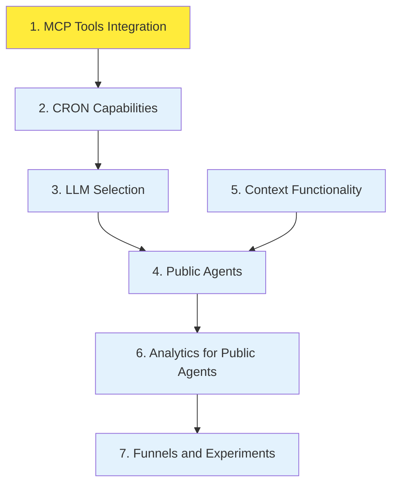

# TeamHub Tasks Overview

This directory contains individual task specifications for the TeamHub enterprise AI agent management platform development roadmap.

## Task Files

Each task is documented in its own file with the following naming convention: `{number}-{description}.md`

### Current Tasks

1. **[MCP Tools Integration](./1-mcp-tools.md)** - _In Development_

   - **Priority**: High
   - **Effort**: 3-4 weeks
   - Docker container isolation for MCP tools per organization

2. **[CRON Capabilities for Agents](./2-cron-capabilities.md)** - _Planned_

   - **Priority**: High
   - **Effort**: 2-3 weeks
   - Scheduled task execution for agents

3. **[LLM Selection in Chat](./3-llm-selection.md)** - _Planned_

   - **Priority**: Medium
   - **Effort**: 1-2 weeks
   - Dynamic LLM selection during conversations

4. **[Public Agents for Customer Websites](./4-public-agents.md)** - _Planned_

   - **Priority**: High
   - **Effort**: 4-5 weeks
   - Embeddable agent widgets for customer sites

5. **[Context Functionality for Agents](./5-context-functionality.md)** - _Planned_

   - **Priority**: Medium
   - **Effort**: 2-3 weeks
   - Enhanced context management and sharing

6. **[Analytics for Public Agents](./6-analytics-public-agents.md)** - _Planned_

   - **Priority**: Medium
   - **Effort**: 3-4 weeks
   - Comprehensive analytics and feedback system

7. **[Funnels and Experiments](./7-funnels-experiments.md)** - _Planned_
   - **Priority**: Low
   - **Effort**: 3-4 weeks
   - A/B testing and conversion optimization

## Task Dependencies



## Development Phases

### Phase 1: Core Infrastructure (Weeks 1-6)

- ✅ **Task 1**: MCP Tools Integration (In Progress)
- **Task 2**: CRON Capabilities for Agents
- **Task 3**: LLM Selection in Chat

### Phase 2: Public Features (Weeks 7-12)

- **Task 5**: Context Functionality for Agents
- **Task 4**: Public Agents for Customer Websites

### Phase 3: Analytics & Optimization (Weeks 13-18)

- **Task 6**: Analytics for Public Agents
- **Task 7**: Funnels and Experiments

## File Structure

Each task file follows this template:

```markdown
# Task Title

**Status**: [In Development|Planned|Completed]
**Priority**: [High|Medium|Low]
**Estimated Effort**: X-Y weeks
**Dependencies**: [Task references or None]

## Description

Brief description of the task

## Requirements

- Detailed requirements list

## Technical Implementation

- Implementation approach

## Acceptance Criteria

- [ ] Checkboxes for completion criteria

## Notes

- Additional considerations
```

## Last Updated

**Date**: December 2024
**Updated By**: Development Team
**Next Review**: January 2025
